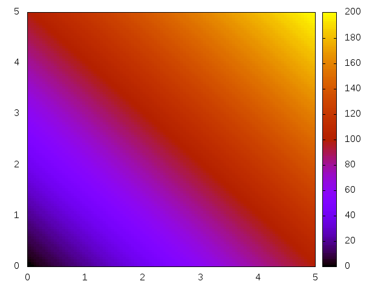

# meshGenerator
My first attempt of creating a mesh grid.

#Installation
no installation needed, ready after being git-cloned

# Use
Unlike my former projects, please avoid using 'make' without any parameters.

Here 4 parameters are needed: NA, NB, A, and B

To simplify, consider a mesh of a rectangle of base A and height B, with small rectangle elements of base NA and height NB.
Note that it is possible to mesh any type of orthogonal rectangle (by this, I mean non parallelogram) with any type of small rectangles.

So just type:

  make NA=100 NB=100 A=5 B=5
  
  
To clean:

  make clean

Note that a cleaning has to be done before any make.

# Results
Among all the data, 3 png files are produced.

#### meshgrid.png

A vizualization of the computed grid, with arbitrary color. Look at it with low number of element in particular.

#### function.png

Plotted array of values of the function, at every (geometric) node.

#### merged.png

Replot of the grid, with color according to the value of the baricentric mean of the function with the 4 elements, for each node. The nice final draw.

Note that the process to obtain this result is highly non optimized, and several things such as the first plots can be avoided to make the computation faster (the goal was to get a result).

Moreover, time of computation is printed during the making, in the shell terminal.
